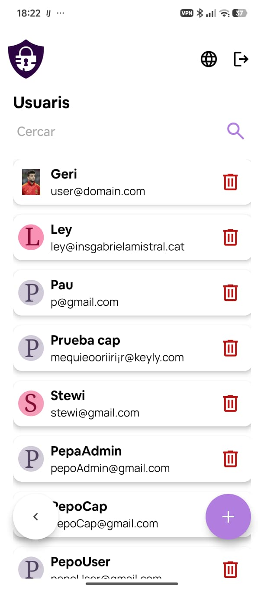
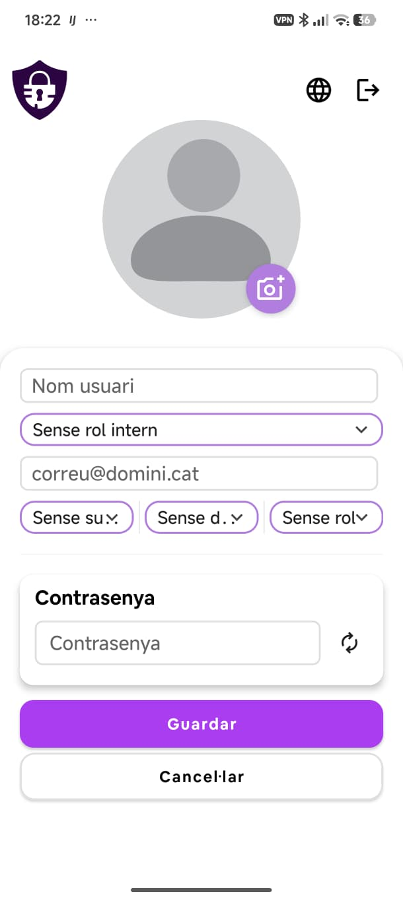
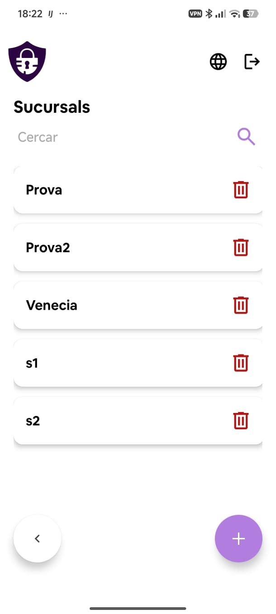
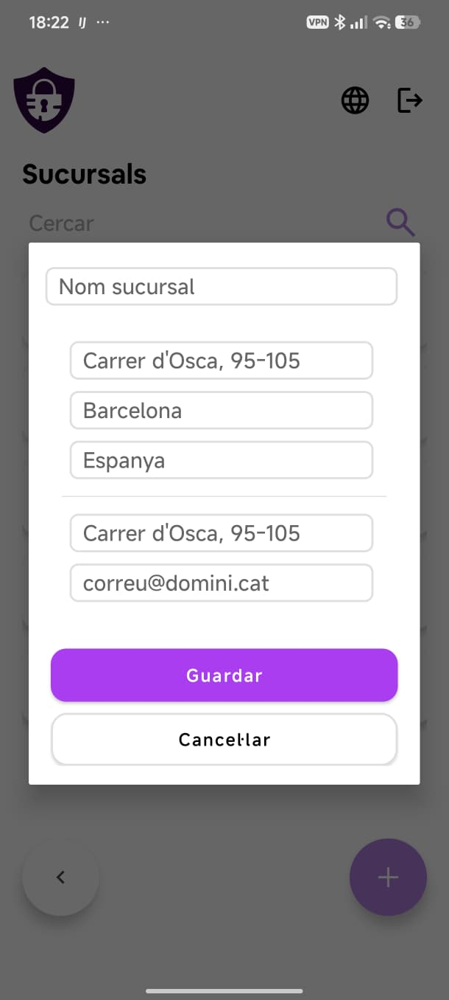
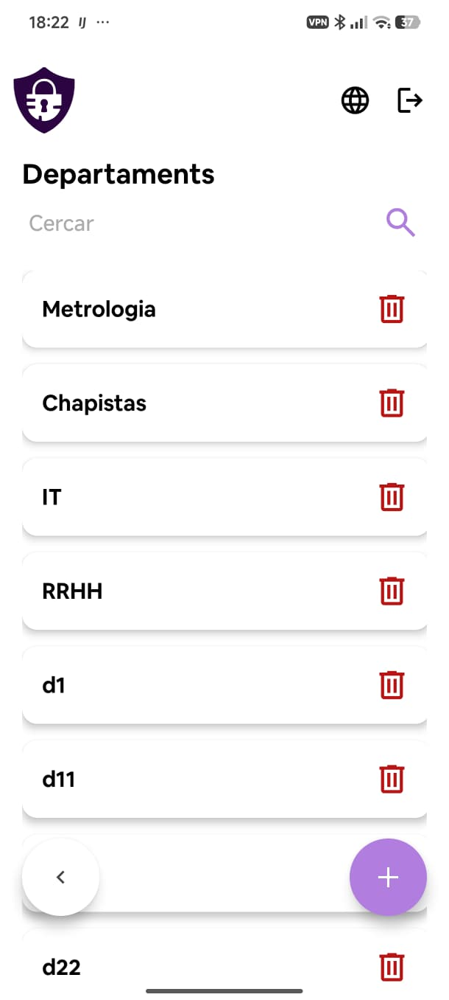
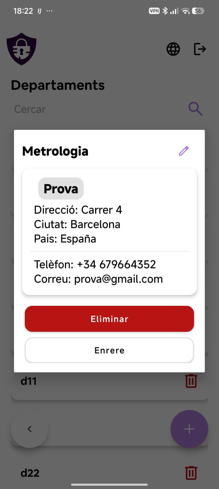
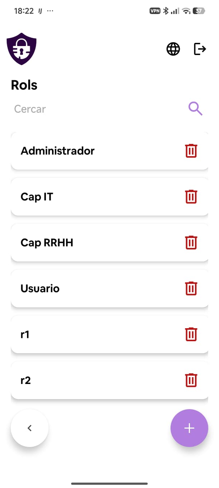
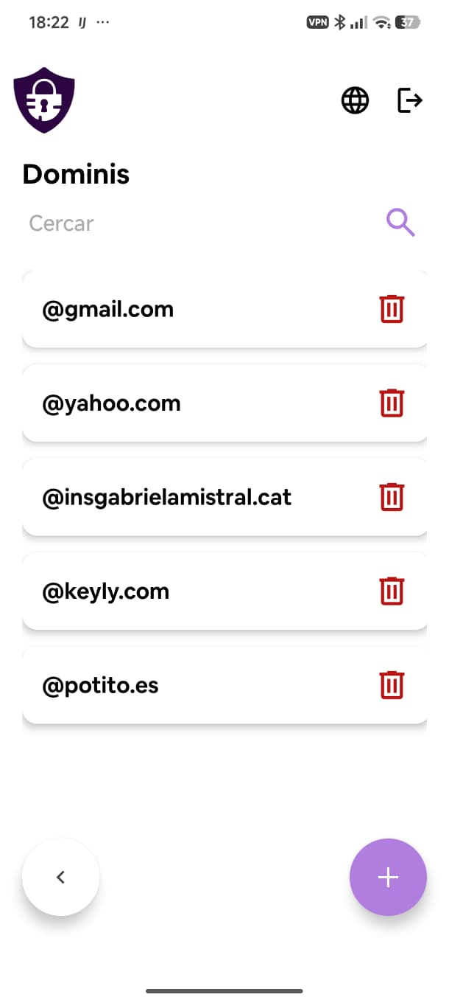

# Administració (pantalles d'admin)

Les pantalles de gestió són accessibles des del perfil quan l'usuari té rol d'administrador o cap. Totes segueixen el mateix patró: llista amb barra de cerca, botó **+** per crear i paperera per eliminar.

---

## Usuaris

Mostra tots els usuaris de l'organització amb el seu nom i correu electrònic. Cada usuari té una foto de perfil o un avatar amb les seves inicials.

Per cercar un usuari concret, utilitza la barra de cerca superior.

### Crear un usuari

El botó **+** obre el formulari de creació. Els camps disponibles són:

| Camp | Descripció |
|---|---|
| Foto de perfil | Opcional, es puja des del dispositiu |
| Nom usuari | Nom visible de l'usuari |
| Rol intern | Selector desplegable (Administrador, Cap, Usuari...) |
| Correu | Correu electrònic d'accés |
| Sucursal | Selector desplegable |
| Departament | Selector desplegable |
| Rol | Selector desplegable |
| Contrasenya | Camp de contrasenya amb generador integrat |

Un cop omplerts els camps, prem **Guardar** per crear l'usuari o **Cancel·lar** per descartar els canvis.

---

## Sucursals

Mostra totes les sucursals de l'organització. Per crear-ne una de nova, prem el botó **+**.

### Crear una sucursal

S'obre un diàleg modal amb els camps:

- Nom de la sucursal
- Adreça (carrer)
- Ciutat
- País
- Telèfon
- Correu electrònic de contacte

Prem **Guardar** per desar o **Cancel·lar** per tancar el diàleg.

---

## Departaments

Llista tots els departaments de l'organització. En prémer un departament s'obre el seu detall.

### Detall d'un departament

El diàleg de detall mostra el nom del departament, la sucursal a la qual pertany (amb la possibilitat de canviar-la mitjançant un selector) i la informació de contacte: adreça, telèfon i correu. Des d'aquí també es pot eliminar el departament.

---

## Rols

Llista tots els rols disponibles a l'organització (Administrador, Cap IT, Cap RRHH, Usuari, etc.). Per crear-ne un de nou, prem el botó **+**. Per eliminar-ne un, prem la paperera corresponent.

---

## Dominis

Llista els dominis de correu electrònic autoritzats per a l'organització (per exemple, `@keyly.com`, `@insgabrielamistral.cat`). Per afegir un domini nou, prem **+**. Per eliminar-ne un, prem la paperera.
