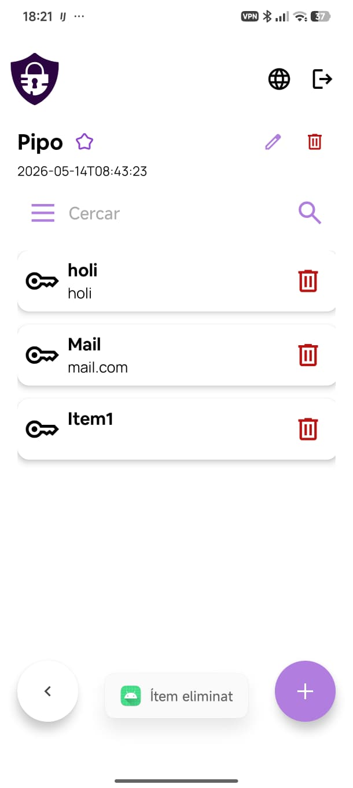
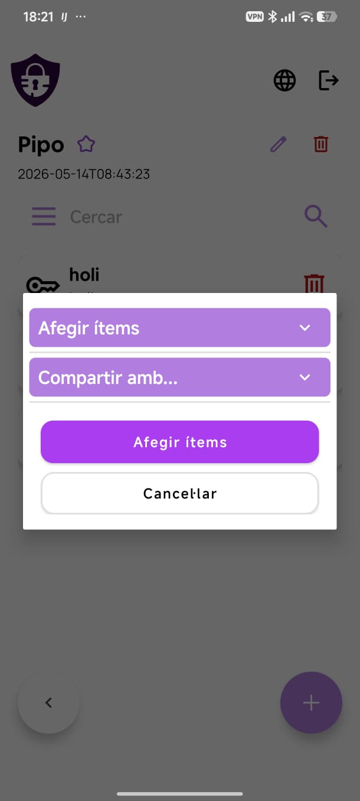

# Carpetes

La pantalla de carpetes funciona igual que la d'ítems: mostra totes les teves carpetes en forma de llista amb barra de cerca, opcions de filtre i botó **+** per crear-ne una de nova.

---

## Interior d'una carpeta

En prémer una carpeta de la llista s'obre el seu contingut. Es mostren:

- El nom de la carpeta i la data de creació a la capçalera.
- Els botons d'edició (llapis) i eliminació (paperera) de la carpeta.
- La barra de cerca per filtrar els ítems de dins.
- La llista d'ítems que conté la carpeta, cadascun amb la seva paperera per treure'l.
- El botó **+** per afegir-hi ítems o compartir la carpeta.

---

## Afegir ítems o compartir una carpeta

En prémer el botó **+** dins d'una carpeta s'obre un diàleg amb les opcions:

- **Afegir ítems** — desplega un selector per triar ítems existents i afegir-los a la carpeta.
- **Compartir amb...** — desplega el selector d'usuaris per compartir tota la carpeta.

Un cop triada l'opció, prem **Afegir ítems** o **Cancel·lar**.
