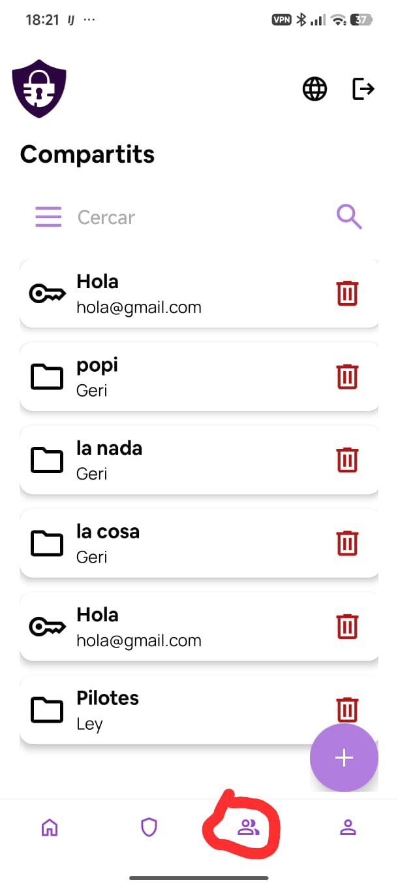

# Compartits

La secció de compartits és accessible des de la icona de persones de la barra de navegació inferior. Mostra en una sola llista tots els ítems i carpetes que t'han compartit i que tu has compartit.

Cada element indica:

- La icona de clau (ítem) o de carpeta.
- El nom de l'ítem o carpeta.
- El nom de l'usuari que l'ha compartit (o que l'ha rebut).

## Cercar i filtrar

La barra superior funciona igual que a la resta de seccions: filtre per les tres línies i cerca per text.

## Crear des de compartits

El botó **+** de la cantonada inferior dreta permet crear un ítem o una carpeta nous que es compartiran automàticament. En prémer-lo s'obre el selector habitual d'ítems i carpetes.

## Eliminar un compartit

La icona de paperera vermella a la dreta de cada element permet revocar l'accés o eliminar el compartit rebut. Apareix la finestra de confirmació abans d'executar l'acció.
