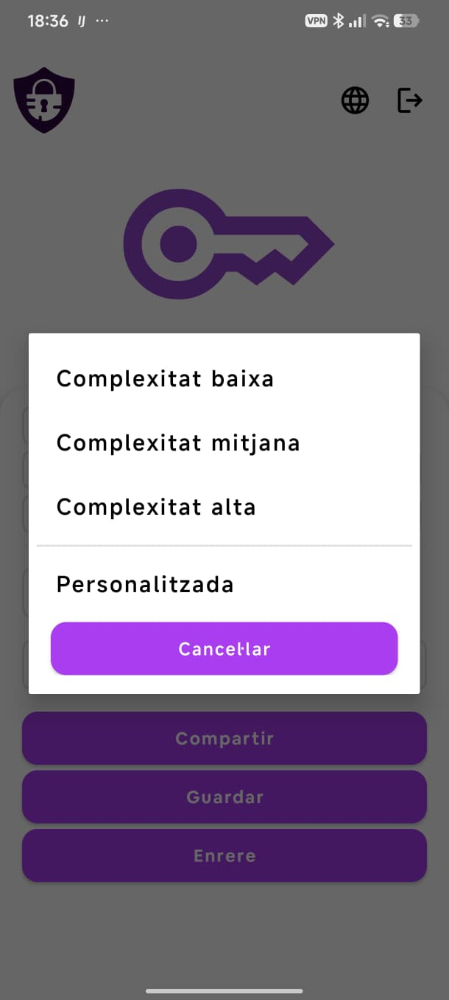
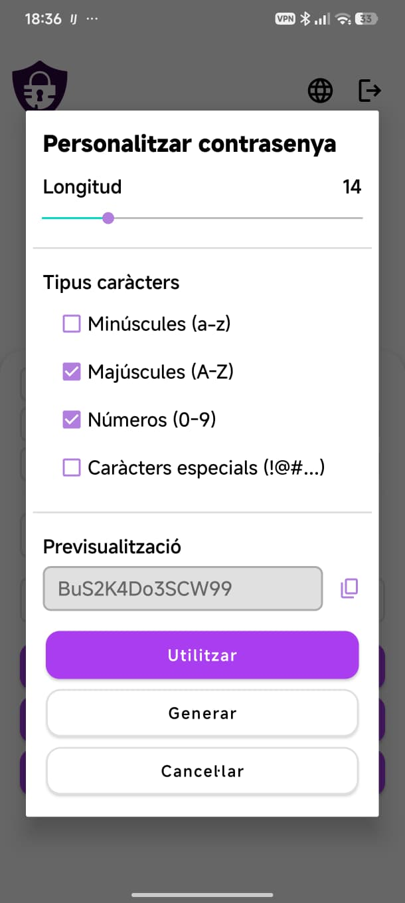
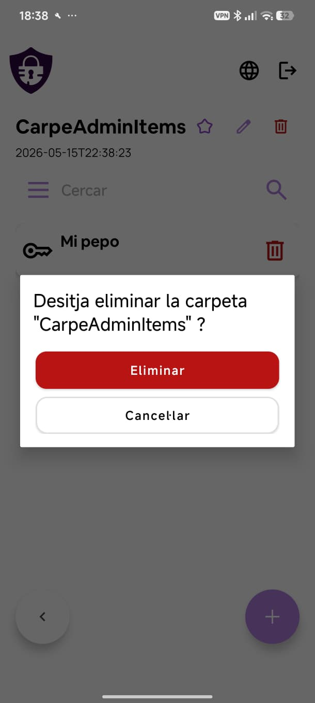

# Eines i diàlegs

## Generador de contrasenyes

El generador s'activa des del camp de contrasenya de qualsevol formulari (ítem o usuari) prement la icona de rotació.

### Selecció de complexitat

En prémer la icona de generació s'obre un diàleg amb quatre opcions de complexitat:

- **Complexitat baixa** — contrasenya senzilla.
- **Complexitat mitjana** — combinació moderada de caràcters.
- **Complexitat alta** — contrasenya llarga amb tots els tipus de caràcters.
- **Personalitzada** — obre el diàleg de configuració avançada.

### Configuració personalitzada

El diàleg de personalització permet configurar:

| Opció | Descripció |
|---|---|
| Longitud | Control lliscant per triar el nombre de caràcters (a la captura, 14) |
| Minúscules (a-z) | Inclou lletres minúscules |
| Majúscules (A-Z) | Inclou lletres majúscules |
| Números (0-9) | Inclou dígits |
| Caràcters especials (!@#...) | Inclou símbols |

A la secció **Previsualització** es mostra la contrasenya generada amb els criteris actuals. Pots copiar-la amb la icona de còpia.

Els botons disponibles són:

- **Utilitzar** — aplica la contrasenya generada al camp del formulari.
- **Generar** — genera una nova contrasenya amb els mateixos criteris.
- **Cancel·lar** — tanca el diàleg sense aplicar cap canvi.

---

## Diàleg de confirmació d'eliminació

Qualsevol acció d'eliminació (ítem, carpeta, usuari, sucursal, departament, rol o domini) mostra un diàleg de confirmació que indica el nom de l'element que s'eliminarà.

- **Eliminar** (vermell) — confirma l'eliminació permanent.
- **Cancel·lar** — tanca el diàleg sense fer cap canvi.

L'eliminació és irreversible.
