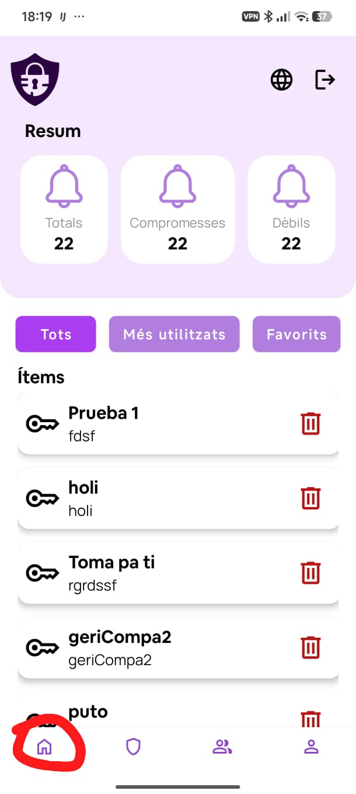

# Pantalla d'inici (Home)

La pantalla d'inici és la primera que veus en entrar a l'aplicació. Es mostra en prémer la icona de casa de la barra de navegació inferior.

## Resum de seguretat

A la part superior apareix un resum amb tres indicadors:

| Indicador | Descripció |
|---|---|
| Totals | Nombre total d'ítems que tens |
| Compromeses | Ítems amb contrasenyes detectades com a febles o comunes |
| Dèbils | Ítems amb contrasenyes que no compleixen els criteris de complexitat |

## Llista d'ítems i carpetes

A continuació es mostra el llistat combinat d'ítems i carpetes. Pots filtrar el contingut mitjançant els tres botons de filtre:

- **Tots** — mostra tots els elements.
- **Més utilitzats** — ordena per nombre d'accessos.
- **Favorits** — mostra únicament els elements marcats com a favorit.

Cada element mostra el nom i l'usuari associat. Per eliminar-ne un, prem la icona de la paperera vermella.

## Navegació inferior

La barra de navegació inferior dóna accés a les quatre seccions principals:

| Icona | Secció |
|---|---|
| Casa | Inici (Home) |
| Escut | Ítems i Carpetes |
| Persones | Compartits |
| Persona | Perfil |
