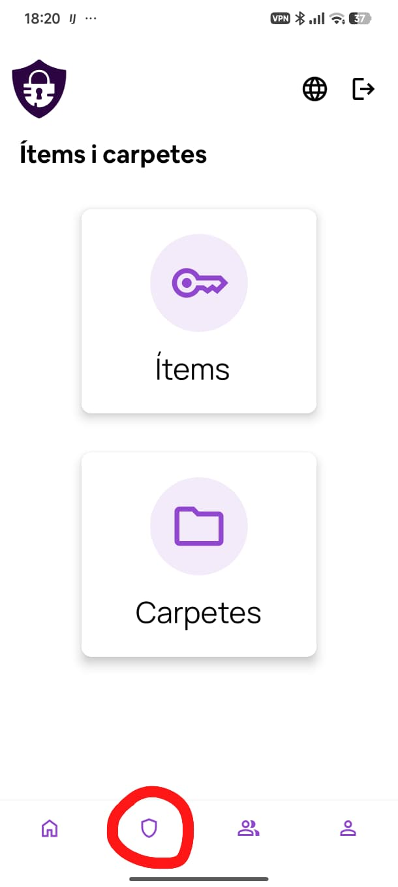
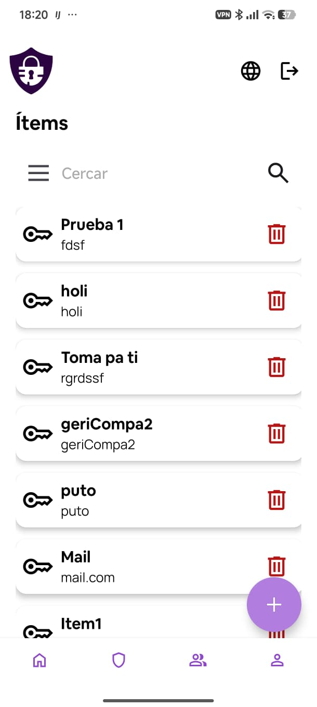
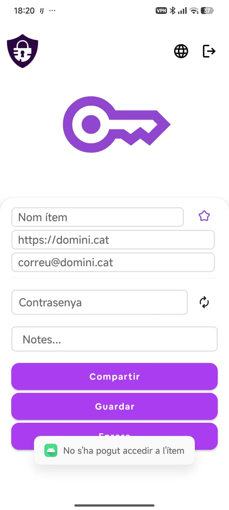
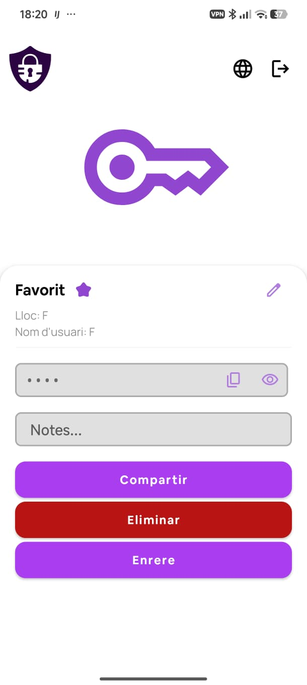

# Ítems i carpetes

En prémer la icona d'escut de la barra de navegació inferior s'obre el selector de secció. Pots triar entre accedir a **Ítems** o a **Carpetes**.

---

## Ítems

La pantalla d'ítems mostra totes les teves credencials en forma de llista. Cada element mostra el nom de l'ítem i el nom d'usuari associat.

### Cercar i filtrar

A la part superior hi ha la barra de cerca. Prem la icona de les tres línies per desplegar les opcions de filtre, o la lupa per cercar per text.

### Crear un ítem nou

Prem el botó **+** violeta a la cantonada inferior dreta per anar a la pantalla de creació.

### Eliminar un ítem

Prem la icona de paperera vermella de l'ítem que vols eliminar. Apareixerà una finestra de confirmació abans d'esborrar-lo definitivament.

---

## Crear un ítem

El formulari de creació conté els camps següents:

| Camp | Descripció |
|---|---|
| Nom ítem | Nom identificatiu de la credencial |
| URL | Adreça web del servei (per exemple, `https://domini.cat`) |
| Correu / usuari | Correu o nom d'usuari associat |
| Contrasenya | Camp de contrasenya. La icona de rotació obre el generador |
| Notes | Text lliure per afegir informació addicional |
| Estrella (favorit) | Marca l'ítem com a favorit |

Un cop omplerts els camps, tens dues opcions:

- **Compartir** — desa l'ítem i immediatament obre el flux per compartir-lo amb altres usuaris.
- **Guardar** — desa l'ítem sense compartir.

---

## Detall d'un ítem

En prémer un ítem de la llista s'obre la vista de detall. Es mostren el nom, la URL, el nom d'usuari i la contrasenya emmascara.

- La icona de **còpia** al costat de la contrasenya la copia al porta-retalls.
- La icona d'**ull** mostra la contrasenya en text pla.
- La icona de **llapis** (cantonada superior dreta) obre el formulari d'edició amb els mateixos camps que la creació.
- El botó **Compartir** inicia el flux per compartir l'ítem amb altres usuaris.
- El botó **Eliminar** (vermell) elimina l'ítem després de confirmar.
- El botó **Enrere** torna a la llista anterior.
