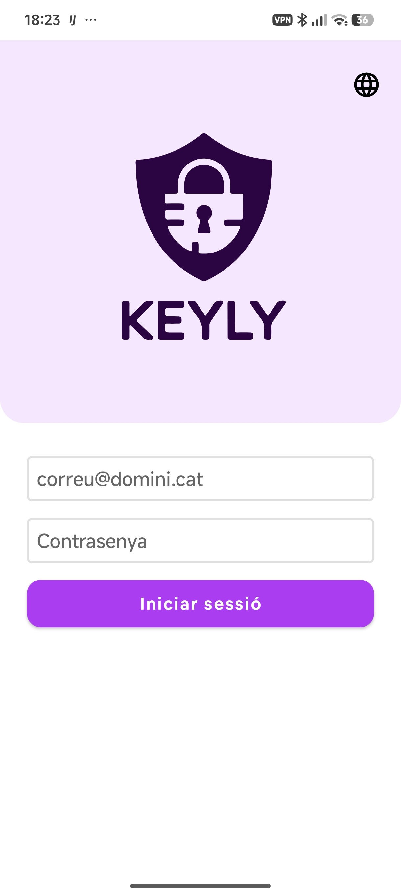
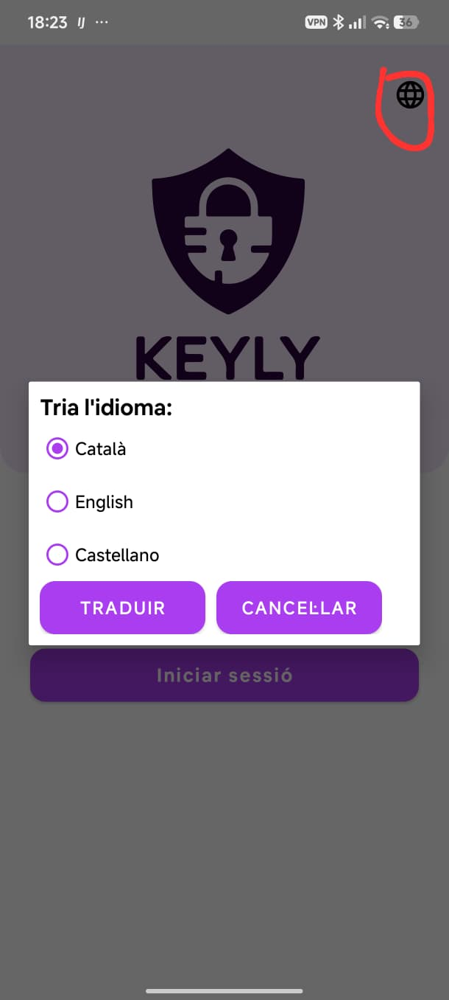

# Accés a l'aplicació

En obrir Keyly es mostra la pantalla d'inici de sessió. Introdueix el teu correu electrònic corporatiu i la contrasenya mestra i prem **Iniciar sessió**.

## Selector d'idioma

A la cantonada superior dreta hi ha la icona del globus terraqüi. En prémer-la s'obre el diàleg de selecció d'idioma. Les opcions disponibles són **Català**, **English** i **Castellano**. Selecciona l'idioma desitjat i prem **Traduir** per aplicar el canvi.

## Tancar sessió

El botó de tancar sessió (icona de sortida) es troba a la barra superior de totes les pantalles de l'aplicació. En prémer-lo, es tanca la sessió i es torna a la pantalla de login.
