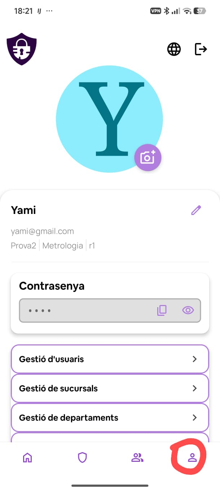

# Perfil

La pantalla de perfil és accessible des de la icona de persona de la barra de navegació inferior.

## Dades personals

A la part superior es mostra l'avatar de l'usuari. La icona de càmera permet canviar la foto de perfil pujant una imatge des del dispositiu.

A continuació apareixen:

- El nom d'usuari amb la icona de llapis per editar-lo.
- El correu electrònic.
- La sucursal, el departament i el rol assignats.

## Contrasenya mestra

La secció **Contrasenya** mostra la clau mestra emmascarada. Les icones al costat permeten copiar-la al porta-retalls o veure-la en text pla.

## Opcions d'administrador

Si l'usuari té rol d'administrador o cap, apareixen a continuació els accessos directes a les seccions de gestió:

- Gestió d'usuaris
- Gestió de sucursals
- Gestió de departaments
- Gestió de rols
- Gestió de dominis
