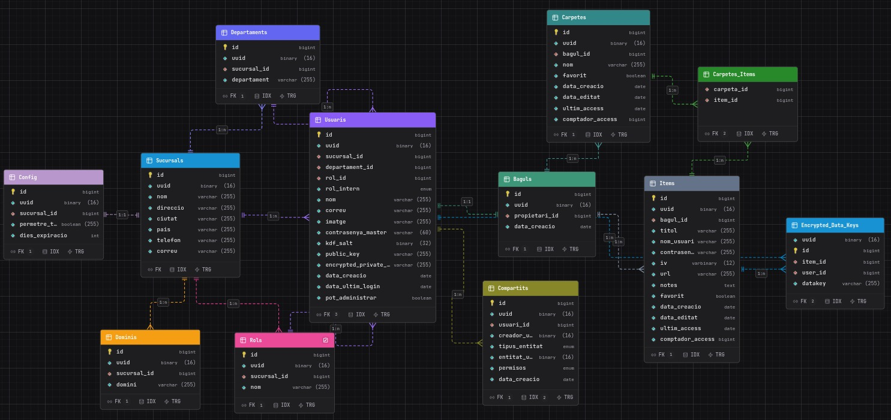

# Base de dades

## Esquema MySQL

Els scripts d'inicialització es troben a `db/mysql-init/` i s'executen en ordre en arrencar el contenidor de MySQL.

### Taules principals

**`Sucursals`** — ubicacions físiques de l'organització. Cada sucursal té nom, adreça, telèfon i correu.

**`Dominis`** — dominis de correu autoritzats per registrar-se a una sucursal (ex: `@keyly.com`). Clau forana a `Sucursals` amb `ON DELETE CASCADE`.

**`Rols`** — rols organitzatius personalitzats per sucursal (distints del `rol_intern` que és un ENUM de sistema).

**`Departaments`** — departaments associats a una sucursal.

**`Usuaris`** — taula central. Camps rellevants per a la seguretat:

| Camp | Tipus | Descripció |
|---|---|---|
| `rol_intern` | ENUM | `ADMIN`, `CAP` o `USUARI`. Controla l'autorització a l'API |
| `contrasenya_master` | VARCHAR(60) | Hash BCrypt de la contrasenya mestra |
| `kdf_salt` | VARBINARY(32) | Salt per a PBKDF2. S'envia al client en el login |
| `public_key` | TEXT | Clau pública RSA-OAEP en base64 (SPKI) |
| `encrypted_private_key` | TEXT | Clau privada xifrada amb AES-GCM en format `{iv}:{ciphertext}` |
| `pot_administrar` | BOOLEAN | Permís addicional per veure tots els compartits de l'organització |

**`Baguls`** — contenidor virtual de cada usuari (1:1 amb `Usuaris`). Tots els ítems i carpetes pertanyen a un bagul.

**`Items`** — credencials xifrades. Els camps `contrasenya` (base64 AES-GCM) i `iv` (VARBINARY 12 bytes) mai es desxifren al servidor.

**`Carpetes`** — agrupa ítems. Relació N:M amb `Items` via la taula `Carpetes_Items`.

**`Compartits`** — registra qui té accés a quin recurs. El camp `entitat_uuid` apunta a l'UUID de l'ítem o carpeta compartida (polimorfisme via `tipus_entitat`).

**`Encrypted_Data_Keys`** — per a cada ítem compartit, emmagatzema la DataKey xifrada amb la clau pública de cada usuari destinatari. Permet que múltiples usuaris puguin desxifrar el mateix ítem cadascun amb la seva pròpia clau privada.

**`Config`** — configuració per sucursal: si es permeten tots els dominis i dies d'expiració de contrasenyes.

### Triggers

| Trigger | Event | Acció |
|---|---|---|
| `trg_after_insert_sucursal` | INSERT a `Sucursals` | Crea automàticament un registre `Config` per a la nova sucursal |
| `trg_usuaris_create_baul` | INSERT a `Usuaris` | Crea automàticament el `Bagul` de l'usuari nou |

### Índexs destacats

`idx_compartits` sobre `(tipus_entitat, entitat_uuid)` a la taula `Compartits` per accelerar les consultes de "qui té accés a aquest recurs".

### Diagrama de base de dades 

## Cassandra (HIBP)

La instància de Cassandra emmagatzema la llista de contrasenyes comprometides del projecte *Have I Been Pwned*. El keyspace és `hibp` i l'accés es fa via Spring Data Cassandra des del servei `UtilsController` / `BagulService`. Quan un client demana si una contrasenya està compromesa, el backend consulta Cassandra i retorna el resultat sense accedir mai a la contrasenya en text pla des del servidor de producció (la consulta prové del client ja hashejada).

